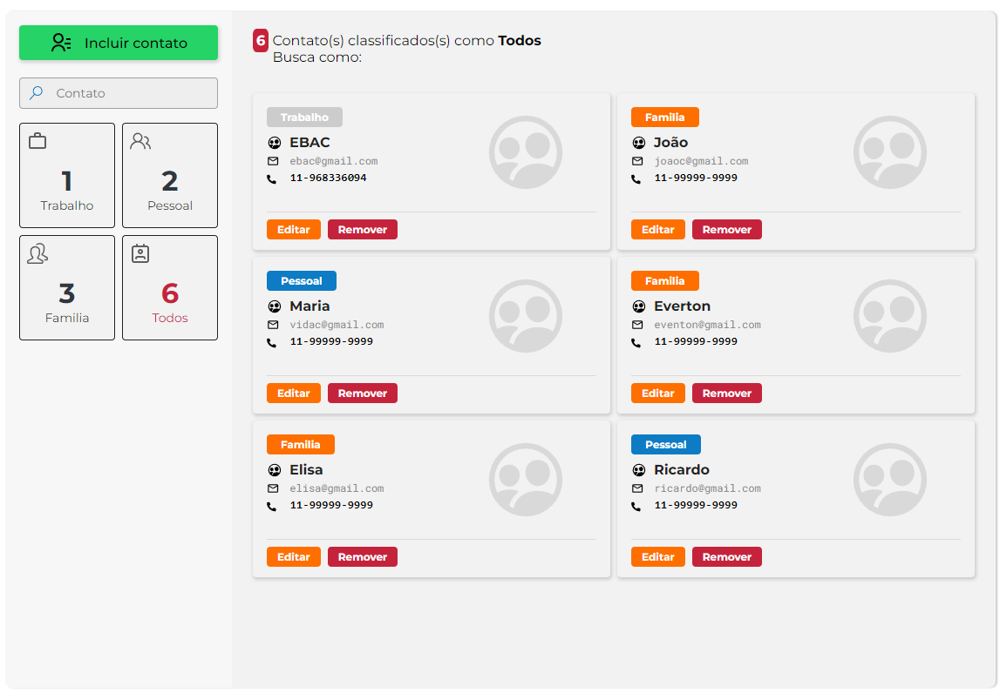
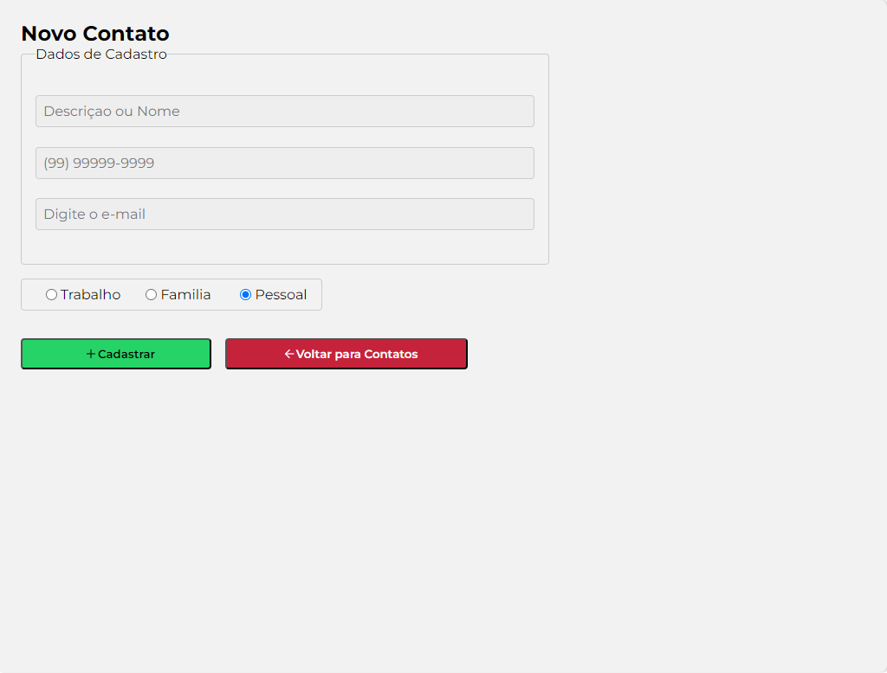

<!-- Banner de Apresentação -->
 
<br>
<br>

<!-- Titulo do Projeto -->

# ✨Contact-List

<!-- Badges do Projeto -->


<!-- Menu -->

## Table of Contents

- [Project description](#project-description)
  - [Functionalities](#functionalities)
- [Setup](#setup)
  - [Prerequisites](#prerequisites)
  - [technologies and tools](#technologies-and-tools)
- [Instalation](#instalation)
- [Usage](#usage)
- [References](#references)
- [Contributors or owners](#contributors-or-owners)
- [Contact](#contact)
- [License](#license)

<!-- Descriçào do Projeto -->

## Project Description

Esse Projeto foi desenvolvido para a pratíca de tecnologias, como `typescript` , `styled-components`, `redux@toolkit`.<br>
Minha fonte de motivação deste projeto foi a [EBAC](https://ebaconline.com.br/). <br>
O **Contac-List** é uma aplicação de gerenciamento de Lista de contatos. <br>

`Task`

- Desenvolver uma aplicação minimalista de um Gerenciador de listas de Contatos usando **@redux/toolkit**

`Charlenge`

Os Maiores desafios foram:<br>
Colocar em pratíca o que foi aprendido no curso, da **EBAC** criando um aplicação simples porem funcional.

### Functionalities

- [x] **Criar um card de contatos**
- [x] **Editar os dados inserridos no Card**
- [x] **Busca po Filtro de Pesquisa, onde o usuário pode pesquisar pelo nome ou pela Categória como: `Famila`, `Pessoal` ou `Trabalho`**<br>

> [!TIP]
>
> Baixe o Projeto em seu Computador e veja como ficou.

<!-- Setup do Projeto -->

## Setup

Requisitos necessários para rodar o projeto:<br>

<!-- ### Recommended IDE Setup

[VSCode](https://code.visualstudio.com/) + [Volar](https://marketplace.visualstudio.com/items?itemName=Vue.volar) (and disable Vetur) + [TypeScript Vue Plugin (Volar)](https://marketplace.visualstudio.com/items?itemName=Vue.vscode-typescript-vue-plugin). -->

### Prerequisites

>

`Node.js` `VSCode` `Git`

> [!IMPORTANT]
>
> - Run Time [Node.js](https://nodejs.org/en/) com a versão _16 ou superior_.<br>
> - Um editor de códigos onde eu recomendo o [VCode](https://code.visualstudio.com/)<br>
> - E o [git](https://git-scm.com/downloads) uma aplicação de versionamento de código.

<!-- > - Extensão do VSCode [**Live Server**](https://marketplace.visualstudio.com/items?itemName=ritwickdey.LiveServer) -->

### technologies and tools

`React` `Vite` `styled-components` `redux` `redux@toolkit` `EditorConfig` `ESLint` `Git`
`Prettier` `Pnpm`

<!-- Bagde dos Repositórios, Node.js Git e Vscode -->
<!-- 

 -->

## Instalation

Para rodar o projeto em seu computador você tera que fazer o [fork](https://docs.github.com/pt/pull-requests/collaborating-with-pull-requests/working-with-forks/fork-a-repo) do repositório. Caso você não saiba como fazer, estou deixando um **link** da documentação oficial do gitHub, onde é esclarecido como fazer essse processo.<br> Fazendo esse processo você tera uma copia desse Repositório no seu GitHub.
<br>

<a href="https://docs.github.com/pt/pull-requests/collaborating-with-pull-requests/working-with-forks/fork-a-repo"></a>

Depois de ter feito o **fork** vamos fazer o [clone](https://docs.github.com/pt/repositories/creating-and-managing-repositories/cloning-a-repository) desse Repositório atráves do **VSCode**. </br>
Caso você não saiba como fazer, estou deixando um link para a documentação oficial do gitHub onde é esclarecido como fazer essse processo.
<br>
<sub>Command Line</sub>

```bash
git clone https://github.com/emmanuelmarcosdeoliveira/contac-list
```


<a href="https://docs.github.com/pt/repositories/creating-and-managing-repositories/cloning-a-repository"></a>

Com o **VSCode** aberto, abra o **terminal**. pelo **VsCode** e vamos fazer a instalação das dependências necessárias para a execução do Projeto:

**1. Instalando as dependências**<br>

 <details open>

<summary>Gerenciador de pacotes usado</summary>

**Pnpm**

</sdetais>

<sub>Command Line</sub>

```npm
pnpm  install
```

<!-- Bagde das Tecnologias-->

<!-- <div align='left'>


 -->
<br>

## Usage

**2. Inicie o Servidor com o seguinte comando dentro do Terminal**<br>
<sub>Command Line</sub>

```pnpm
pnpm dev
```

</br>
</br>
<!-- Importante -->

> [!IMPORTANT]
>
> O projeto será iniciado, e será aberto no Navegador.
> Você também pode acessa-lo digitando na Barra de Endereço do seu Navegador
> **localhost://5173**

</br>

 <!-- Imagem de Demostração -->
<h3 align="center"> Imagem de demostração do Projeto</h3>

</br>
</br>




<!-- <h3 align="center">📽️project demonstration video</h3>
<br>
<p align="center">Video de Demostraçào</p>

https://github.com/emmanuelmarcosdeoliveira/animais-fantasticos/assets/116108389/660fb676-c9a6-4083-b28c-8e952eaa6345 -->

<br>
 <div align="center">
Acesse a versão on-line Projeto clicando no Link Abaixo
<br>
<br>
<a href="https://to-do-vue-xi-pink.vercel.app/">
</a>

</div>
<br>

## References

**Acesse:** [EBAC](https://ebaconline.com.br/)

## Contributors or owners

|                                     owner                                     |
| :---------------------------------------------------------------------------: |
|  |
|                               Emmanuel Oliveira                               |

Creation of styles and project development by 💖 [Emmanuel Oliveira](https://www.linkedin.com/feed/?trk=homepage-basic_sign-in-submit)<br>
&copy; Todos os Direitos Reservados

## Contact

<a href ="https://wa.me/5511968336094"></a>
<a href = "mailto:oliveira.devfullstack@gmail.com"></a>
<a href="https://www.linkedin.com/in/oliveira-marcos-emmanuel?lipi=urn%3Ali%3Apage%3Ad_flagship3_profile_view_base_contact_details%3BUetG4s3ZT76Byt3XWdZ2Tg%3D%3D" target="_blank"></a><br>
<sub>😁Obrigado por chegar até aqui!<sub>

## License

<br>
Released in 2024 This project is under the **MIT license**<br>
<br>
<br>

[`voltar ao topo`](#-portfólio-github)
